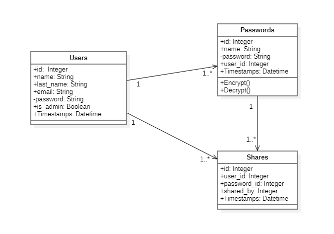

# Koncepcja projektu "PASSWD"

## Technologie
- Laravel
- React
- MySQL
- React Bootstrap

## Opis
W tym projekcie zakładam stworzenie aplikacji webowej do przechowywania i
bezpiecznego udostępniania haseł pomiędzy pracownikami w organizacji.
Aplikacja umożliwi użytkownikom tworzenie, edytowanie i usuwanie haseł,
a następnie przesyłanie ich pomiędzy zarejestrowanymi użytkownikami.
Aplikacja będzie wykorzystywać autorski algorytm dwustronnego szyfrowania haseł.

## Diagram klas

## Diagram przypadków użycia

## Opis algorytmu szyfrowania
Algorytm dwustronnego szyfrowania hasłem to metoda zabezpieczania danych,
która szyfruje podane przez użytkownika hasło, wykorzystując zabezpieczający klucz do szyfrowania i deszyfrowania informacji.
Algorytm ten zapewnia większe bezpieczeństwo niż standardowe metody szyfrowania,
ponieważ stosowane są dodatkowe sole, które trudno odgadnąć bez znajomości kodu źródłowego aplikacji.

## Sposób działania algorytmu szyfrowania
1. Użytkownik podaje hasło.
2. Elementami klucza szyfrującego są:
    - secret zapisywany w pliku .env
    - ciąg 12 losowych znaków
    - pierwsza litera imienia i nazwiska dodającego hasło, oddzielone od siebie cyfrą 4
3. Wszystkie znaki klucza łączone są ze sobą bezpośrednio, bez żadnych separatorów,
   a klucz szyfrowany jest za pomocą algorytmu bcrypt.
4. Hasło szyfrowane jest za pomocą algorytmu AES-256-CBC, wykorzystując wcześniej opisany klucz.
5. Następnie wykonywany jest wpis do bazy nowo zaszyfrowanego hasła wraz z ciągiem losowych znaków wygenerowanych wcześniej dodanym po kropce.

## Opis funkcjonalności
- Użytkownik będzie mógł tworzyć, edytować i usuwać własne hasła i przesyłać je do innych użytkowników.
- Hasła szyfrowane są za pomocą autorskiego algorytmu dwustronnego szyfrowania.
- Użytkownicy będą mogli przeglądać i przesyłać pomiędzy sobą hasła.
- Administratorzy mogą zarządzać użytkownikami i zarządzać hasłami.

*By [Michał Szajner](https://github.com/M1chalS)*